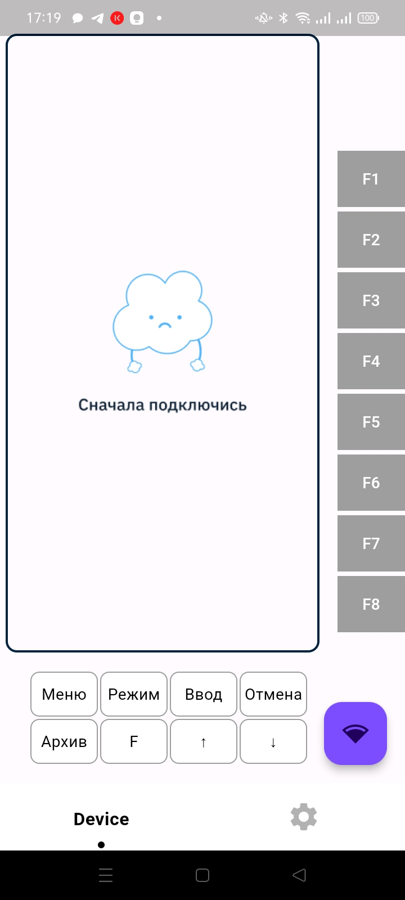

# Test WiFi App


## Описание

Test WiFi App - это проект на Flutter для конфигурации лифта через Bluetooth. В основу заложен паттерн проектирования MVVM.

## Скриншоты





## Начало работы

Следуйте этим инструкциям для настройки и запуска проекта на локальной машине.

### Необходимые условия

- Flutter SDK: [установка Flutter](https://flutter.dev/docs/get-started/install)
- IDE с поддержкой Flutter (например, Android Studio, VS Code)

### Установка

1. Клонируйте репозиторий
    ```bash
    git clone https://github.com/Byteemin/test_wifi_app.git
    cd test_wifi_app
    ```

2. Установите зависимости
    ```bash
    flutter pub get
    ```

3. Запустите приложение
    ```bash
    flutter run
    ```

## Использование

Этот проект включает в себя функционал сканирования, подключения и обмена данными между приложением и лифтом по Bluetooth.

## Структура проекта

Проект состоит из нескольких файлов и директорий в папке `lib`, каждый из которых выполняет свою роль:

### `lib/`

Директория содержит 2 папки и два файла.

#### `main.dart`

Основной файл, который запускает приложение. Содержит функцию `main()`, где инициализируется приложение.

#### `main_wrapper.dart`

Определяет главный экран приложения. Содержит навигацию и первую вкладку, а также инициализирует Bluetooth.

#### `domain/`

Директория содержит бизнес-логику приложения, сохранение данных пользователя, работу с Bluetooth.

##### `data_providers/`

Содержит файл `user_settings_data.dart`, в котором описана инициализация данных и их сохранение.

##### `entity/`

Содержит файл `user.dart`, вспомогательный для сохранения и инициализации данных.

##### `service/`

Содержит три файла:
- `bluetooth_service.dart`: работа с Bluetooth (сканирование, подключение, отправка сообщений, прослушивание потока сообщений).
- `esp_commands.dart`: содержит базовые команды для отправки их по подключению.
- `user_service.dart`: инициализирует данные для работы с ними и сохраняет их.

#### `views/`

Директория содержит 3 файла, определяющих отображение вкладок навигации приложения.

##### `network_connection_view.dart`

Классы для отображения подключения Bluetooth:
- `_ViewModel`: модель представления для подключения бизнес-логики с отображением для данной вкладки.
- `_BluetoothConnectionsWidget()`: область, где отображаются устройства.
- `_ScanButton()`: кнопка для начала сканирования.
- `_BlueDeviceWidget()`: отображает подсказки для пользователя или карточки с найденными устройствами (имя и MAC-адрес устройства).

##### `network_data_view.dart`

Кнопки с командами для отправки по Bluetooth и данные, получаемые по подключению:
- `_ViewModel`: модель представления для подключения бизнес-логики с отображением для данной вкладки.
- `_ComandListWidget()`: поле, отображающее полученные данные по подключению.
- `_ButtonHelpWidget()`: кнопки нижнего ряда.
- `_ButtonFWidget()`: кнопки бокового ряда.

##### `network_settings_view.dart`

Настройки для конфигурации приложения. Реализована настройка фильтрации найденных устройств по Bluetooth:
- `_ViewModel`: модель представления для подключения бизнес-логики с отображением для данной вкладки.
- `_BluetoothSettingsWidget()`: оболочка поля ввода для изменения видимости настроек фильтрации.
- `_BluetoothSettingsDataWidget()`: поле ввода для задания маски фильтрации устройств.
- `_SaveButtonWidget()`: кнопка сохранения настроек.

## ЧаВо (FAQ)

**Вопрос:** Как подключиться к лифту через Bluetooth?
**Ответ:** Перейдите на вкладку "Подключение", нажмите кнопку "Сканировать" и выберите нужное устройство из списка.

**Вопрос:** Как сохранить настройки?
**Ответ:** Перейдите на вкладку "Настройки", внесите изменения и нажмите кнопку "Сохранить".

## Известные проблемы

- **Проблема:** Приложение не видит устройства.
  **Решение:** Убедитесь, что Bluetooth включен и устройство находится в зоне видимости.

- **Проблема:** Приложение не подключается к устройствам Android, IOS и так далее.
  **Решение:** Проблема в корне используемого плагина для работы с блютуз.
